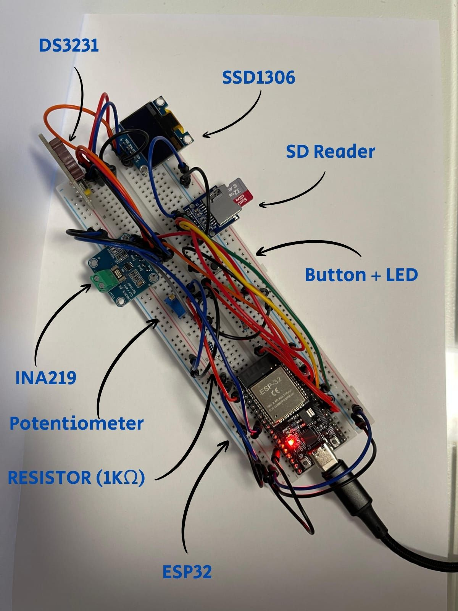

# Voltage logger
Voltage logger project using ESP32, FreeRTOS, I2C, SPI, SD CARD, INA219 and more.

## Features
- The system is controlled by FreeRTOS.
- Button controls the system status (ON/OFF).
- A timer controls the readings.
- When the system is OFF, the LED will be turned off, the timer stops, display will be cleared
  and SPI & file will be closed/free.
- When the system is ON, the LED will be turned on, the timer starts, display will display `LOADING...`,
  and SPI will be reset if it's not the first time the system is on.
- Potentiometer controls the voltage of the resistor through ADC and DAC.
- Latest voltage readings will be shown on the display as an ongoing graph.
- Data will be transferred via SPI to the SD card in batches of 20.
- In case of system OFF in the middle of data transfer to the SD card, data loss will occur.
- System starts with OFF status.

## Demo

### 🎥 Video Demo
[▶️ Watch full demo (MP4)](assets/demo.mp4?raw=1)

---

### 📸 Project Images

  
   
  <em>Voltage Logger breadboard – top view</em>

---

### 📊 Sample Data
The system logs voltage readings to an SD card in CSV format.  
[Download sample CSV](assets/voltlog.csv?raw=true)

## Installation
- Clone this repository:  
  git clone https://github.com/GoldmanLiyam/voltage-logger.git
- Open with VS CODE and PlatformIO extension
- Connect ESP32 board
- Upload code via PlatformIO

## Usage
- Button press - change system status
- Potentiometer change - change resistor's voltage

## Hardware
- ESP32 DevKit v1
- INA219
- DS3231
- SSD1306
- SD card 32GB
- 6mm Button
- SD card reader
- 10kΩ potentiometer
- 3mm, 3V LED
- 330Ω resistor
- 1KΩ resistor
- Breadboard & jumpers

## License
This project is licensed under the MIT License - see the [LICENSE](LICENSE) file for details.

Created by Liyam Goldman

